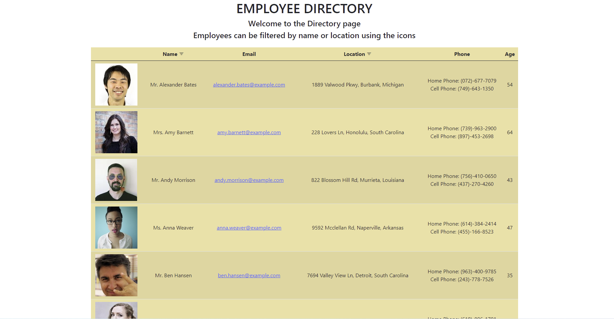

# Employee-Directory

# Table of Contents 
* [Description](#description)
* [Usecase](#Usecase)
* [Installation](#installation)
* [Contributors](#contributors)
* [License](#license)
* [Questions](#questions)
    
## Description: 
filter through employees using props in react framework
## Installation: 
npm install, npx-create-react-app
## Usecase: 
find employees in your directory by name or their location 
## License: 
[Unlicensed](Unlicensed.txt)
## Contributors: 
Nich Parson
## Testing: 
none
## Questions: 
Contact me by the following for any questions:
* Github:(https://github.com/Nparson88)
* Email: Nparson88@gmail.com 
## Screenshots
* 

## Deployed app
* heroku: (https://shielded-beach-49438.herokuapp.com/)